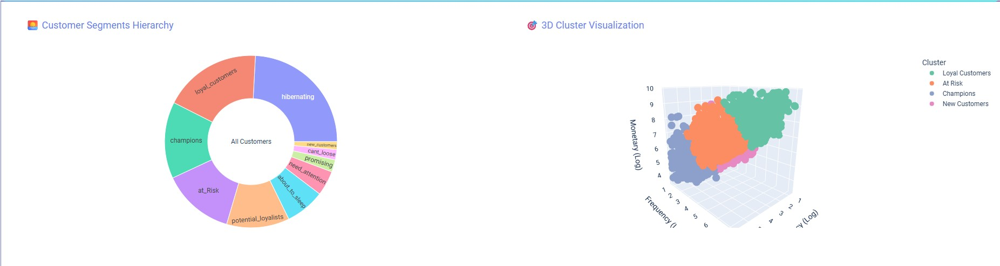
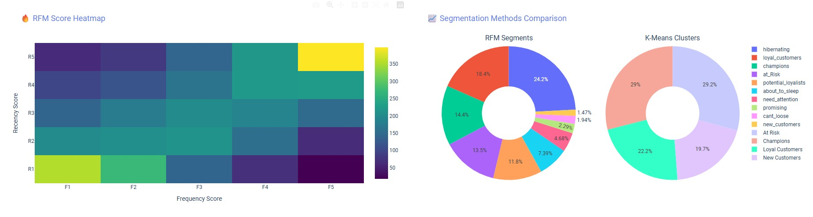
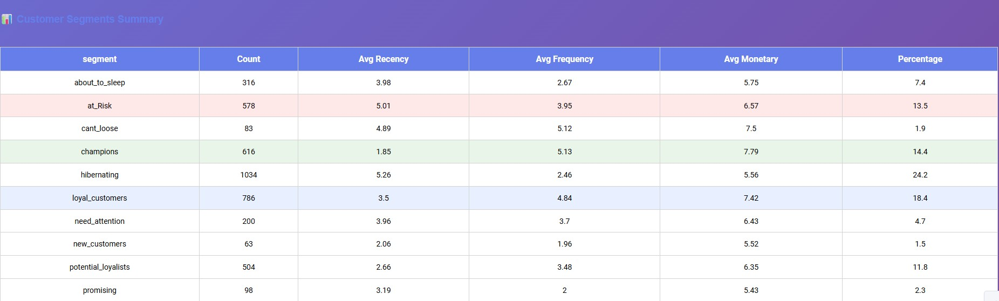

# Customer Segmentation Analysis

[](https://opensource.org/licenses/MIT)
[](https://www.python.org/downloads/)
[](https://plotly.com/)
[](https://dash.plotly.com/)
[](https://scikit-learn.org/)
[](https://pandas.pydata.org/)

Customer segmentation using RFM analysis & K-means clustering with interactive Plotly Dash dashboard. Transform e-commerce data into actionable business insights with predictive analytics.

## 🎯 Project Overview

This end-to-end customer analytics solution provides:

• **RFM Analysis**: Customer segmentation using Recency, Frequency, Monetary value analysis with automated scoring  
• **K-means Clustering**: Machine learning-based customer grouping with optimal cluster determination  
• **Interactive Dashboard**: Beautiful Plotly Dash web interface for exploring segmentation results  
• **Predictive Analytics**: Model persistence and new customer classification capabilities  
• **Production Ready**: Modular codebase with organized structure for easy integration and deployment  
• **Business Intelligence**: Actionable insights into customer behavior patterns and segment characteristics  

The system analyzes customer transaction data to identify distinct customer segments, enabling businesses to implement targeted marketing campaigns, personalized customer experiences, and data-driven retention strategies.

## Features

- **Dual Segmentation**: Both RFM traditional analysis and ML-based K-means clustering
- **Interactive Dashboard**: Beautiful Plotly Dash interface with 3D visualizations
- **Model Persistence**: Save and load trained models for production use
- **Automated Analysis**: Complete pipeline from raw data to actionable insights
- **Comparative Analytics**: Side-by-side comparison of segmentation methods
- **Prediction System**: Classify new customers into existing segments

## Data Source

This project is based on the following Kaggle resources:
- **Original Notebook**: [Customer Segmentation RFM and K-means](https://www.kaggle.com/code/abdocan/customer-segmentation-rfm-and-kmeans/notebook)
- **Dataset**: [E-commerce Data](https://www.kaggle.com/datasets/carrie1/ecommerce-data)

## Technology Stack

- **Data Analysis**: Pandas, NumPy, Matplotlib, Seaborn
- **Machine Learning**: Scikit-learn, K-means Clustering
- **Visualization**: Plotly, Dash
- **Model Persistence**: Pickle, Joblib
- **Development**: Python 3.7+, Jupyter Notebooks

## 📁 Project Structure

```
customer-segmentation/
├── main.py                       # Main analysis script
├── prediction.py                 # Customer prediction functions  
├── requirements.txt              # Python dependencies
├── .gitignore                    # Git ignore rules
├── README.md                     # This documentation
│
├── dashboard/                    # Interactive dashboard
│   └── dashboard.py             # Plotly Dash web application
│
├── data/                         # Data directory
│   └── data.csv                 # Customer transaction data
│
├── images/                       # Dashboard screenshots
│   ├── image1.jpg               # Dashboard overview
│   ├── image2.jpg               # RFM analysis visualization
│   ├── image3.jpg               # K-means clustering results
│   └── image4.jpg               # Comparative analysis
│
├── notebooks/                    # Jupyter notebooks
│   └── customer-segmentation-rfm-and-kmeans.ipynb
│
├── outputs/                      # Generated results (auto-created)
│   ├── README.md                # Output documentation
│   ├── rfm_segments.csv         # RFM analysis results
│   ├── clustered_segments.csv   # Clustering results
│   └── models/                  # Saved ML models
│       ├── kmeans_model.pkl     # Trained K-means model
│       ├── scaler.pkl           # Feature scaler
│       └── cluster_labels.pkl   # Cluster mappings
│
└── utils/                        # Core analysis functions
    ├── data_processing.py       # Data cleaning & preparation
    ├── rfm_analysis.py          # RFM calculation & segmentation
    └── clustering.py            # K-means clustering functions
```

## 🔍 Dataset

The project uses the E-commerce Dataset from Kaggle:

• **Source**: [E-commerce Data](https://www.kaggle.com/datasets/carrie1/ecommerce-data)  
• **Features**: Customer transactions, product details, purchase history, geographical data  
• **Target**: Customer segmentation based on purchasing behavior

## 📓 Kaggle Notebook

For detailed analysis and methodology, check out the complete Kaggle notebook:

• **Notebook**: [Customer Segmentation RFM and K-means](https://www.kaggle.com/code/abdocan/customer-segmentation-rfm-and-kmeans/notebook)  
• **Content**: Complete data analysis, RFM calculation, clustering implementation, and visualization

## 🛠️ Installation

### Prerequisites

• Python 3.7+
• pip package manager

### Setup

```bash
# Clone repository (if from git)
git clone <your-repo-url>
cd customer-segmentation

# Create virtual environment
python -m venv venv
venv\Scripts\activate  # On Windows
source venv/bin/activate  # On macOS/Linux

# Install dependencies
pip install -r requirements.txt
```

### Dataset

1. Download the dataset from [E-commerce Data](https://www.kaggle.com/datasets/carrie1/ecommerce-data)
2. Place `data.csv` in the `data/` directory

## 🚀 Quick Start

### 1. Run Complete Analysis

```bash
python main.py
```

### 2. Make Predictions

```bash
# Interactive prediction
python prediction.py
```

### 3. Launch Dashboard

```bash
cd dashboard
python dashboard.py
```

Dashboard will be available at `http://localhost:8050`

**Services will be available at:**  
• **Dashboard**: `http://localhost:8050`  
• **Analysis Results**: Check `outputs/` folder for CSV files and saved models

## 🖼️ Dashboard Screenshots

The interactive dashboard provides comprehensive visualization of customer segmentation results:

### Dashboard Overview


### RFM Analysis Visualization


### K-means Clustering Results


### Comparative Analysis


## 📊 Analysis Output

After running `main.py`, the following files are generated in `outputs/`:

| File | Description |
|------|-------------|
| `rfm_segments.csv` | Individual customer RFM scores and segments |
| `clustered_segments.csv` | Customer cluster assignments and labels |
| `models/kmeans_model.pkl` | Trained clustering model |
| `models/scaler.pkl` | Feature normalization model |
| `models/cluster_labels.pkl` | Cluster name mappings |

## 📈 Usage Examples

### Python Script

```python
# Run complete analysis
python main.py

# Make predictions for new customers
from prediction import predict_from_saved_models
segment = predict_from_saved_models(recency=30, frequency=5, monetary=200)
print(f"Customer segment: {segment}")
```

### Dashboard Interface

Use the web interface at `http://localhost:8050` for interactive exploration of results.

## 🧪 Development

• **Analysis**: [Kaggle notebook](https://www.kaggle.com/code/abdocan/customer-segmentation-rfm-and-kmeans/notebook) with complete methodology  
• **Training**: Run `python main.py` to execute full analysis pipeline  
• **Customization**: Modify parameters in `utils/` modules for different analysis approaches

## 📝 Data Format

Your `data.csv` should contain:

| Column | Description |
|--------|-------------|
| `InvoiceNo` | Transaction ID |
| `StockCode` | Product code |
| `Description` | Product description |
| `Quantity` | Items purchased |
| `InvoiceDate` | Transaction date |
| `UnitPrice` | Price per item |
| `CustomerID` | Unique customer ID |
| `Country` | Customer country |

## 🤝 Contributing

1. Fork the repository
2. Create a feature branch (`git checkout -b feature/amazing-feature`)
3. Commit changes (`git commit -m 'Add amazing feature'`)
4. Push to branch (`git push origin feature/amazing-feature`)
5. Open a Pull Request

## 📄 License

This project is licensed under the MIT License - see the [LICENSE](LICENSE) file for details.

## 🙏 Acknowledgments

• Dataset provided by [Carrie](https://www.kaggle.com/carrie1) on Kaggle  
• Scikit-learn community for excellent ML tools  
• Plotly team for interactive visualization framework  
• Dash team for the web application framework  

---

⭐ **Star this repository if you found it helpful!**